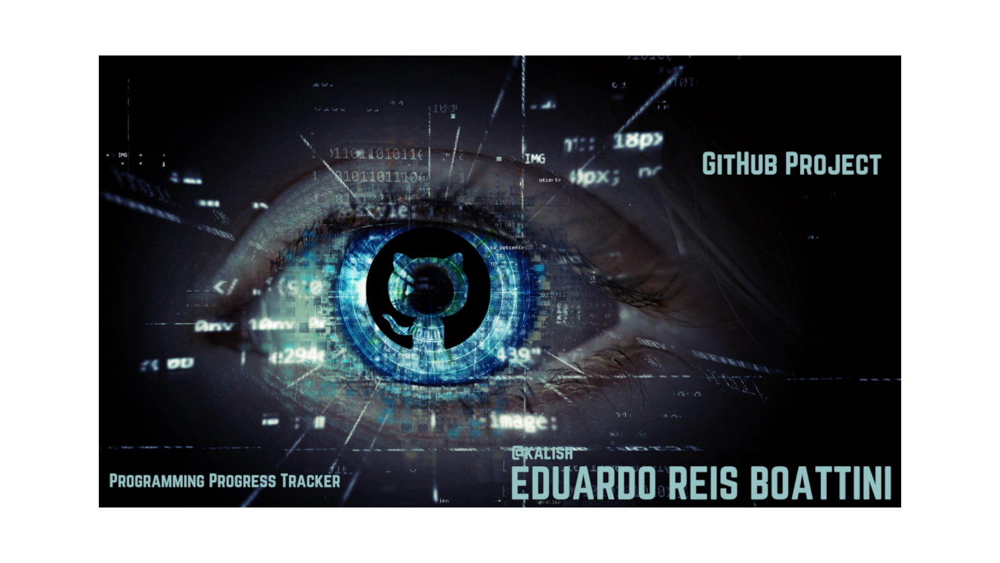
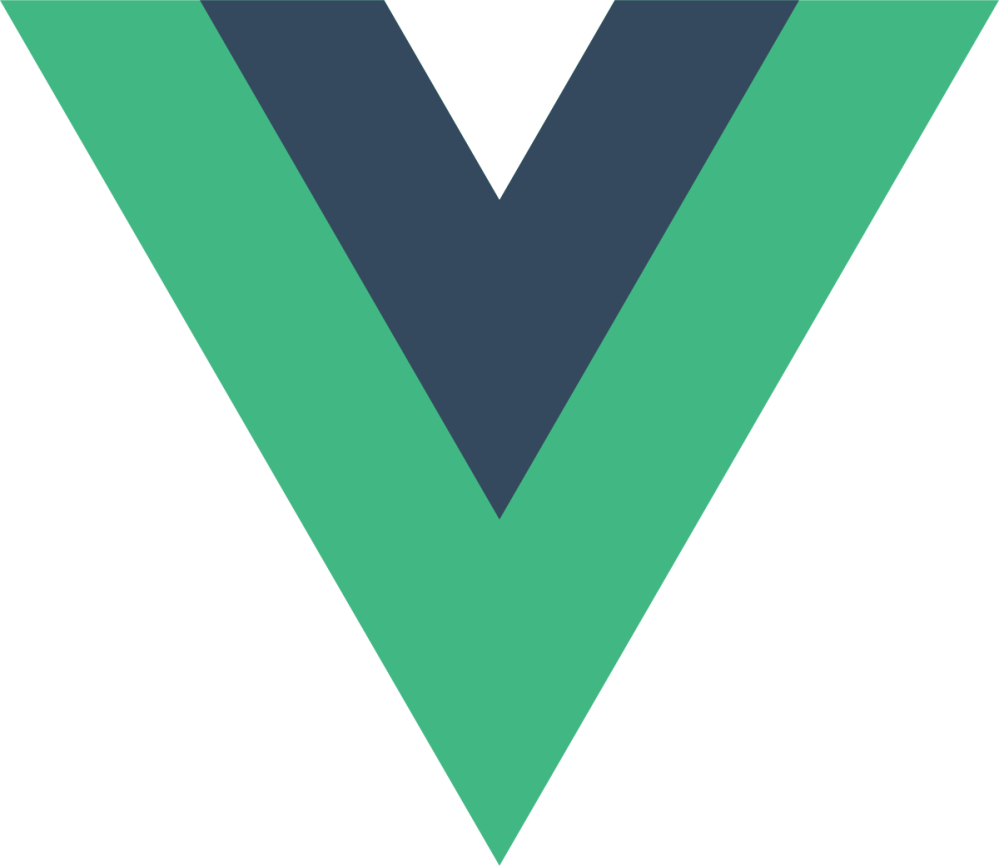
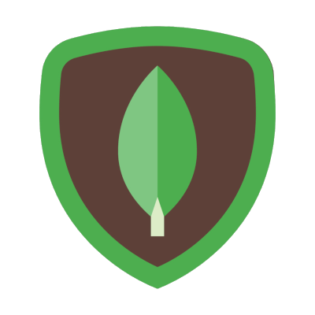
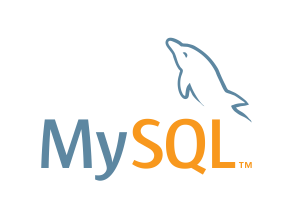
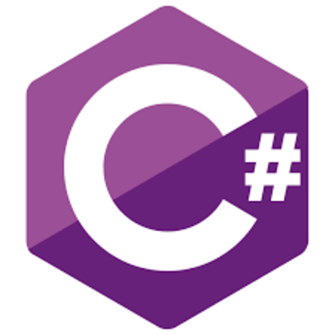

### Hi there 👋, I'm Eduardo!
📫 How to reach me: eduardo.reis@unifesp.br

<!--
**Eduardoreisboattini/Eduardoreisboattini** is a ✨ _special_ ✨ repository because its `README.md` (this file) appears on your GitHub profile.

Here are some ideas to get you started:

- 🔭 I’m currently working on ...
- 🌱 I’m currently learning ...
- 👯 I’m looking to collaborate on ...
- 🤔 I’m looking for help with ...
- 💬 Ask me about ...
- 📫 How to reach me: ...
- 😄 Pronouns: ...
- ⚡ Fun fact: ...
-->

<h1 align="center">GitHub PROJECT</h1>

<p align="center">
 &nbsp;&nbsp;
</p>


<p align="center">
  Self-Learning<br> Programming Progress Tracker<br>
</p>

<p align="center">
  Eduardo Reis Boattini<br>
  Computer Science Student at UNIFESP
</p>

<p align="center">
  <a href="https://lnkd.in/dkmjaM9y">
    
  </a>
</p>
<br> 
<p align="center">
  <a href="https://www.linkedin.com/in/eduardoreisboattini/">
    &nbsp;&nbsp;
  </a>
  <a href="https://www.unifesp.br/campus/sjc">
    &nbsp;&nbsp;
  </a>
  <a href="mailto:edu_boa@hotmail.com">
    &nbsp;&nbsp;
  </a>
</p>

<h2>Introduction</h2>

Welcome to the Self-Learning Programming Progress Tracker!<br>  
<p align="center">
  <a href="https://github.com/Eduardoreisboattini/GitHub_PROJECT">
    
  </a>
</p>
🚀 This repository serves as a personal log of my journey in learning programming languages independently.
Through this project, I aim to document my progress, showcase the skills I have acquired, and provide insights into the projects I have completed.

<h2>Motivation</h2>
The motivation behind this project is to demonstrate my dedication and passion for programming.<br>
💪 By embarking on this self-learning journey, I have honed my skills in various programming languages and technologies. 
Through continuous learning, practice, and hands-on projects, I have deepened my understanding and expertise in the world of programming.

<h2>Project Structure</h2>

The repository is organized into the following directories:

### 📚 Programming Foundations

1. [Basic Programming Concepts](https://github.com/Eduardoreisboattini/GitHub_PROJECT/tree/main/%2300%2001.Basic%20Programming%20Concepts): Get familiar with variables, data types, operators, control structures (if-else, loops), functions, and basic I/O operations. These concepts apply to almost every programming language and are the backbone of any program.

2. [Data Structures](https://github.com/Eduardoreisboattini/GitHub_PROJECT/tree/main/%2300%2002.Data%20Structures): Understanding data structures like arrays, linked lists, stacks, queues, trees, and graphs is essential. They help you organize and manipulate data efficiently, and they are crucial in designing algorithms.

3. [Basic Mathematics](https://github.com/Eduardoreisboattini/GitHub_PROJECT/tree/main/%2300%2003.Basic%20Mathematics): While you don't need to be a math genius, having a good grasp of basic arithmetic, algebra, and boolean logic will significantly help you in writing algorithms and solving problems.

4. [Problem-Solving Techniques](https://github.com/Eduardoreisboattini/GitHub_PROJECT/tree/main/%2300%2004.Problem-Solving%20Techniques): Learn problem-solving strategies, such as breaking down problems into smaller steps, pattern recognition, and devising algorithms to solve them. This skill is invaluable when tackling complex programming challenges.

5. [Understanding of Memory Management](https://github.com/Eduardoreisboattini/GitHub_PROJECT/tree/main/%2300%2005.Understanding%20of%20Memory%20Management): Be aware of how memory works in your chosen programming language and how to manage resources effectively to avoid memory leaks or performance issues.

6. [Recursion](https://github.com/Eduardoreisboattini/GitHub_PROJECT/tree/main/%2300%2006.%20Recursion): Understanding recursion is essential for solving problems that can be naturally solved by dividing them into smaller sub-problems.

7. [Version Control](https://github.com/Eduardoreisboattini/GitHub_PROJECT/tree/main/%2300%2007.Version%20Control): While not directly related to programming logic, learning version control systems like Git will greatly benefit you when collaborating with others and managing your codebase.

### 📚 [Programming Languages](https://github.com/Eduardoreisboattini/Programming-Languages)

Contains subdirectories for each programming language I have learned, where you can find code snippets, exercises, and small projects demonstrating my proficiency in that particular language. Some of the languages I have acquired proficiency in include but are not limited to Python, JavaScript, Java, C++, and HTML/CSS. Each language directory within this repository provides examples and projects that demonstrate my knowledge and skills in that particular language.

### 📚 Advanced Topics

1. [Object-Oriented Programming (OOP)](https://github.com/Eduardoreisboattini/GitHub_PROJECT/tree/main/%2300%2011.Object-Oriented%20Programming%20OOP): OOP is a paradigm where you design programs as collections of objects, each with its data and behaviors. Understanding classes, objects, encapsulation, inheritance, and polymorphism are essential in OOP.

2. [Logic and Boolean Algebra](https://github.com/Eduardoreisboattini/GitHub_PROJECT/tree/main/%2300%2012.Logic%20and%20Boolean%20Algebra): This is fundamental to understanding how programming conditions and decisions work. You'll need to understand logical operators, truth tables, and how to construct logical expressions.

3. [Algorithms and Data Structures](https://github.com/Eduardoreisboattini/GitHub_PROJECT/tree/main/%2300%2013.Algorithms%20and%20Data%20Structures): Building on your earlier knowledge of data structures, dive deeper into various algorithms like sorting, searching, graph algorithms, dynamic programming, etc. Knowing algorithmic complexity (Big O notation) is crucial for optimizing code.
[
4. [Design Patterns](https://github.com/Eduardoreisboattini/GitHub_PROJECT/tree/main/%2300%2014.Design%20Patterns): Learn about common design patterns that help you solve recurring problems in software design. These patterns improve code maintainability, reusability, and organization.

5. [Software Development Principles](https://github.com/Eduardoreisboattini/GitHub_PROJECT/tree/main/%2300%2015.Software%20Development%20Principles): Familiarize yourself with concepts like DRY (Don't Repeat Yourself), KISS (Keep It Simple, Stupid), SOLID principles, and other best practices to write clean, efficient, and maintainable code.

### 💡 [Projects](https://github.com/Eduardoreisboattini/Projects)

Includes subdirectories for different projects I have completed, showcasing my ability to solve problems and create functional applications using various programming languages. Throughout my journey, I have undertaken several hands-on projects, ranging from small utilities and web applications to more complex algorithms and data structure implementations. The Projects directory includes a detailed description of each project, its purpose, and the technologies employed.

### 📖 [Resources](https://github.com/Eduardoreisboattini/Resources)

Contains useful resources, tutorials, and reference materials I have utilized during my learning journey.

### 📖 [Languages and Tools](https://github.com/Eduardoreisboattini/Languages-and-Tools)

<a href="https://w3.org">
  
</a>

<a href="https://developer.mozilla.org/en-US/docs/Web/JavaScript">
  
</a>

<a href="https://react.dev/">
  
</a>

<a href="https://redux.js.org/">
  
</a>

<a href="https://nodejs.org/en">
  
</a>

<a href="https://www.typescriptlang.org">
  
</a>

<a href="https://vuejs.org/">
  
</a>

<a href="http://expressjs.com/">
  
</a>

<a href="https://git-scm.com/">
  
</a>

<a href="https://www.mongodb.com/">
  
</a>

<a href="https://www.mysql.com/">
  
</a>

<a href="https://www.sqlite.org/index.html">
  
</a>

<a href="https://www.php.net">
  
</a>

<a href="https://dotnet.microsoft.com/en-us/languages/csharp">
  
</a>

<a href="https://learn.microsoft.com/en-us/cpp/cpp">
  
</a>

<a href="https://www.python.org/">
  
</a>

<a href="https://www.tensorflow.org/">
  
</a>

<a href="https://getbootstrap.com/">
  
</a>
<br>

### ⭐ [Progress Highlights](https://github.com/Eduardoreisboattini/Progress-Highlights)
Here are some of the key highlights of my self-learning programming journey.

### 🌱 [Learning Process](https://github.com/Eduardoreisboattini/Learning-Process)

I believe in continuous learning and improving my skills. 🎯 I have consistently sought out resources, online courses, and programming challenges to enhance my knowledge and practical abilities. The Resources directory contains a curated list of the materials that have been valuable to my learning journey.

## Contributing
### Getting Started

To explore my progress and the projects I have completed, follow these steps:

1. Clone the repository to your local machine using the following command:

   ```bash
   git clone https://github.com/Eduardoreisboattini/GitHub_PROJECT.git

2. Navigate to the desired language or project directory to explore the code and documentation.

While this repository primarily serves as a personal log of my self-learning journey, I am open to collaborations and feedback.<br> If you have suggestions, improvements, or interesting project ideas, feel free to create an issue or submit a pull request. I appreciate any contributions that can help enhance my programming skills further.


## Tech Stack

### Front End Technologies
[](https://developer.mozilla.org/en-US/docs/Web/Guide/HTML/HTML5)
[](https://www.markdownguide.org/)
[](https://developer.mozilla.org/en-US/docs/Web/CSS)
[](https://developer.mozilla.org/en-US/docs/Web/JavaScript)
[](https://www.typescriptlang.org/)
[](https://www.json.org/)
[](https://reactjs.org/)
[](https://redux.js.org/)
[](https://jquery.com/)
[](https://vuejs.org/)
[](https://expressjs.com/)
[](https://nodejs.org/)
[](https://www.djangoproject.com/)
[](https://angular.io/)
[](https://getbootstrap.com/)
[](https://www.redhat.com/en/topics/api/what-is-a-rest-api)

#
[](https://sass-lang.com/)
[](http://lesscss.org/)
[](https://stylus-lang.com/)
[](https://webpack.js.org/)
[](https://babeljs.io/)
[](https://gulpjs.com/)
[](https://gruntjs.com/)
[](https://parceljs.org/)
[](https://webassembly.org/)
[](https://pugjs.org/)
#
[](https://ejs.co/)
[](https://handlebarsjs.com/)
[](https://d3js.org/)
[](https://threejs.org/)
[](https://greensock.com/gsap/)
[](https://www.chartjs.org/)
[](https://www.highcharts.com/)
#
[](https://axios-http.com/)
[](https://rxjs.dev/)
[](https://jestjs.io/)
[](https://mochajs.org/)
[](https://www.chaijs.com/)
[](https://enzymejs.github.io/enzyme/)
[](https://www.cypress.io/)
[](https://storybook.js.org/)
#
[](https://developer.mozilla.org/en-US/docs/Web/API/WebSockets_API)
[](https://graphql.org/)
[](https://www.apollographql.com/)
[](https://www.w3.org/XML/)


### Database Languages

[](https://www.sqlite.org/)
[](https://www.mysql.com/)
[](https://www.postgresql.org/)
[](https://www.oracle.com/)
[](https://graphql.org/)

### Server-Side Languages

[](https://www.php.net/)
[](https://www.python.org/)
[](https://www.ruby-lang.org/)
[](https://www.java.com/)
[](https://docs.microsoft.com/en-us/dotnet/csharp/)
[](https://nodejs.org/)
[](https://golang.org/)
[](https://www.perl.org/)
[](https://www.rust-lang.org/)
[](https://kotlinlang.org/)

### NoSQL Databases

[](https://www.mongodb.com/)
[](https://redis.io/)

### Full Stack Technologies

[](https://www.gnu.org/software/bash/)
[](https://redux.js.org/)
[](https://webpack.js.org/)
[](https://www.docker.com/)
[](https://kubernetes.io/)
[](https://git-scm.com/)
[](https://github.com/)
[](https://gitlab.com/)
[](https://www.jenkins.io/)
[](https://travis-ci.org/)
[](https://www.heroku.com/)

#
[](https://aws.amazon.com/)
[](https://azure.microsoft.com/)
[](https://cloud.google.com/)
[](https://www.netlify.com/)
[](https://vercel.com/)
[](https://www.nginx.com/)
[](https://httpd.apache.org/)
[](https://ubuntu.com/)
[](https://www.microsoft.com/en-us/windows/)
[](https://www.apple.com/macos/)

#
[](https://code.visualstudio.com/)
[](https://www.sublimetext.com/)
[](https://www.vim.org/)
[](https://trello.com/)
[](https://slack.com/)
[](https://discord.com/)
[](https://www.figma.com/)
[](https://www.notion.so/)
[](https://meet.google.com/)
[](https://zoom.us/)


### Other Languages

[](https://en.wikipedia.org/wiki/Assembly_language)
[](https://www.gnu.org/software/bash/)
[](https://isocpp.org/)
[](https://en.wikipedia.org/wiki/Clipper_(programming_language))
[](https://clojure.org/)
[](https://en.wikipedia.org/wiki/COBOL)
[](https://dart.dev/)
[](https://www.embarcadero.com/products/delphi)
[](https://elixir-lang.org/)
[](https://fortran-lang.org/)
[](https://www.haskell.org/)
[](https://en.wikipedia.org/wiki/IBM_BASIC)
[](https://en.wikipedia.org/wiki/JavaScript)
[](https://www.lua.org/)
[](https://www.mathworks.com/products/matlab.html)
[](https://www.embarcadero.com/products/delphi)
[](https://developer.apple.com/documentation/objectivec)
[](https://www.freepascal.org/)
[](https://en.wikipedia.org/wiki/PEARL_(programming_language))
[](https://www.r-project.org/)
[](https://www.scala-lang.org/)
[](https://www.gnu.org/software/bash/)
[](https://swift.org/)
[](https://docs.microsoft.com/en-us/dotnet/visual-basic/)
[](https://docs.microsoft.com/en-us/office/vba/library-reference/concepts/getting-started-with-vba-in-office)

##  GitHub Stats

[](https://github.com/Eduardoreisboattini)
[](https://github.com/Eduardoreisboattini)
[](https://github.com/users/Eduardoreisboattini)
[](https://github.com/Eduardoreisboattini)

#

[](https://github.com/Eduardoreisboattini/Eduardoreisboattini/releases)
[](https://github.com/Eduardoreisboattini)

#
[](https://github.com/Eduardoreisboattini?tab=repositories)
[](https://github.com/Eduardoreisboattini)
[](https://github.com/Eduardoreisboattini/Eduardoreisboattini/commits)
[](https://gist.github.com/Eduardoreisboattini)
<br>
[](https://github.com/Eduardoreisboattini/Eduardoreisboattini/network/members)
[](https://github.com/Eduardoreisboattini/Eduardoreisboattini/stargazers)
[](https://github.com/Eduardoreisboattini/Eduardoreisboattini/issues)
[](https://github.com/Eduardoreisboattini/Eduardoreisboattini/pulls)
<br>
[](https://github.com/Eduardoreisboattini/Eduardoreisboattini)
<br>
[](https://github.com/ellerbrock/open-source-badges/)

<h2>Contact</h2>
If you have any questions, want to collaborate, or simply discuss programming, please feel free to reach out to me.<br> You can contact me via email or connect with me on LinkedIn.

              
<br>
<br>

<a href="https://www.linkedin.com/in/eduardoreisboattini/">
  
</a>

<a href="https://www.facebook.com/eboattini/">
  
</a>

<a href="https://twitter.com/ed_re_bo">
  
</a>

<a href="https://discord.gg/tgUv67yD">
  
</a>

<a href="https://www.instagram.com/ed_re_bo">
  
</a>

<a href="https://www.youtube.com/@KALISHworld/">
  
</a>
<br>
<br>

[](https://github.com/Eduardoreisboattini)
[](https://twitter.com/ed_re_bo)
[](https://www.instagram.com/ed_re_bo)
[](https://www.facebook.com/eboattini/)
[](https://discord.gg/tgUv67yD)

[](https://www.reddit.com/user/Ok-Illustrator-5372/)
[](https://stackoverflow.com/users/14016130/eduardo-reis-boattini)
[](https://dev.to/eduardoreisboattini/)
[](https://medium.com/@edureisboa/)

[](https://www.twitch.tv/kalish_world)
[](https://www.youtube.com/@KALISHworld/)

[](https://www.patreon.com/KalishWorld)

<br>
<h2>Conclusion</h2>
Thank you for taking the time to explore my self-learning programming progress tracker. <br>
This project reflects my dedication, determination, and love for programming.<br> I am continuously growing and expanding my skill set, and I look forward to further challenges and opportunities that will fuel my learning journey.
<br>
<br>
Happy coding!
<br>
<br>
<footer>
    <div class="footer-container">
        <p>&copy; 2023 Eduardo Reis Boattini - Online Course. All rights reserved.</p>
        <ul class="footer-menu">
            <li><a href="./PrivacyPolicy.md">Privacy Policy</a></li>
            <li><a href="./TermsOfService.md">Terms of Service</a></li>
            <li><a href="mailto:eduardo.reis@unifesp.br">Contact Us</a></li>
        </ul>
    </div>
    <div class="footer-disclaimer">
        <p>The information provided on this website is for general informational purposes only and does not constitute professional advice. Consult a qualified professional for specific guidance related to your situation.</p>
    </div>
</footer>
