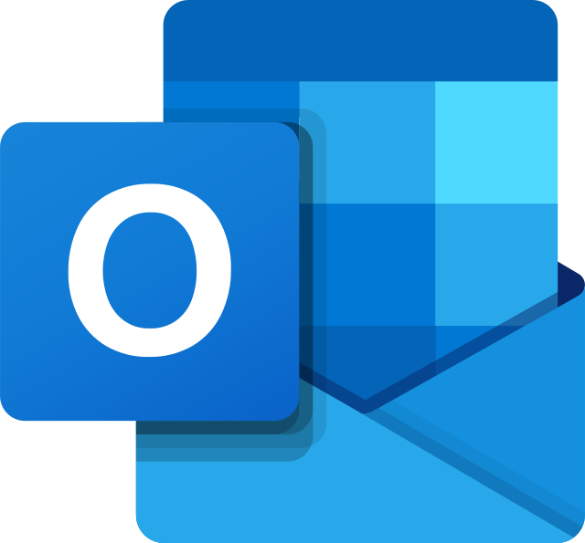

### Hi there 👋

<!--
**Eduardoreisboattini/Eduardoreisboattini** is a ✨ _special_ ✨ repository because its `README.md` (this file) appears on your GitHub profile.

Here are some ideas to get you started:

- 🔭 I’m currently working on ...
- 🌱 I’m currently learning ...
- 👯 I’m looking to collaborate on ...
- 🤔 I’m looking for help with ...
- 💬 Ask me about ...
- 📫 How to reach me: ...
- 😄 Pronouns: ...
- ⚡ Fun fact: ...
-->
<h1 align="center">GitHub PROJECT</h1>

<p align="center">
  
</p>

<p align="center">
  Self-Learning<br> Programming Progress Tracker<br>
</p>

<p align="center">
  Eduardo Reis Boattini<br>
  Computer Science Student at UNIFESP
</p>

<p align="center">
  <a href="https://linkedin.com/in/eduardoreisboattini">
    &nbsp;&nbsp;
  </a>
  <a href="mailto:eduardo.reis@unifesp.br">
    &nbsp;&nbsp;
  </a>
  <a href="mailto:edu_boa@hotmail.com">
    &nbsp;&nbsp;
  </a>
</p>


<h2>Introduction</h2>

Welcome to the Self-Learning Programming Progress Tracker!<br>  
<br> 
🚀 This repository serves as a personal log of my journey in learning programming languages independently.
<br> 
Through this project, I aim to document my progress, showcase the skills I have acquired, and provide insights into the projects I have completed.

<a href="https://www.w3.org/">
  
</a>

<a href="https://developer.mozilla.org/en-US/docs/Web/JavaScript">
  
</a>

<a href="https://react.dev/>
  
</a>

<a href="https://redux.js.org/">
  
</a>

<a href="https://getbootstrap.com/">
  
</a>

<a href="https://nodejs.org/en">
  
</a>

<a href="https://www.linkedin.com/in/eduardoreisboattini/">
  
</a>

<a href="http://expressjs.com/">
  
</a>

<a href="https://git-scm.com/">
  
</a>

<a href="https://www.mongodb.com/">
  
</a>

<a href="https://www.mysql.com/">
  
</a>

<a href="https://www.sqlite.org/index.html">
  
</a>

<a href="https://www.python.org/">
  
</a>

<a href="https://www.tensorflow.org/">
  
</a>

<h2>Motivation</h2>
The motivation behind this project is to demonstrate my dedication and passion for programming.<br>
💪 By embarking on this self-learning journey, I have honed my skills in various programming languages and technologies. 
Through continuous learning, practice, and hands-on projects, I have deepened my understanding and expertise in the world of programming.

<h2>Project Structure</h2>

The repository is organized into the following directories:

<h3>📚 #00 Programming Languages</h3>

Contains subdirectories for each programming language I have learned, where you can find code snippets, exercises, and small projects demonstrating my proficiency in that particular language. Some of the languages I have acquired proficiency in include but are not limited to Python, JavaScript, Java, C++, and HTML/CSS. Each language directory within this repository provides examples and projects that demonstrate my knowledge and skills in that particular language.

<h3>💡 #00 Projects</h3>

Includes subdirectories for different projects I have completed, showcasing my ability to solve problems and create functional applications using various programming languages. Throughout my journey, I have undertaken several hands-on projects, ranging from small utilities and web applications to more complex algorithms and data structure implementations. The Projects directory includes a detailed description of each project, its purpose, and the technologies employed.

<h3>📖 #00 Resources</h3>

Contains useful resources, tutorials, and reference materials I have utilized during my learning journey.

<h3>⭐ #00 Progress Highlights</h3>

Here are some of the key highlights of my self-learning programming journey:

<h3>🌱 #00 Learning Process</h3>

I believe in continuous learning and improving my skills. 🎯 I have consistently sought out resources, online courses, and programming challenges to enhance my knowledge and practical abilities. The Resources directory contains a curated list of the materials that have been valuable to my learning journey.

<h2>Contributing</h2>
## Getting Started

To explore my progress and the projects I have completed, follow these steps:

1. Clone the repository to your local machine using the following command:

   ```bash
   git clone https://github.com/Eduardoreisboattini/GitHub_PROJECT.git

2. Navigate to the desired language or project directory to explore the code and documentation.

While this repository primarily serves as a personal log of my self-learning journey, I am open to collaborations and feedback.<br> If you have suggestions, improvements, or interesting project ideas, feel free to create an issue or submit a pull request. I appreciate any contributions that can help enhance my programming skills further.

<h2>Contact</h2>
If you have any questions, want to collaborate, or simply discuss programming, please feel free to reach out to me.<br> You can contact me via email or connect with me on LinkedIn.
<br>
<br>

<a href="https://www.linkedin.com/in/eduardoreisboattini/">
  
</a>

<a href="https://www.facebook.com/eboattini/">
  
</a>

<a href="https://twitter.com/ed_re_bo">
  
</a>

<a href="https://discord.gg/tgUv67yD">
  
</a>

<a href="https://www.instagram.com/ed_re_bo">
  
</a>

<a href="https://www.youtube.com/@KALISHworld/">
  
</a>

<br>
<h2>Conclusion</h2>
Thank you for taking the time to explore my self-learning programming progress tracker. <br>
This project reflects my dedication, determination, and love for programming. I am continuously growing and expanding my skill set, and I look forward to further challenges and opportunities that will fuel my learning journey.
<br> <br>
Happy coding!
